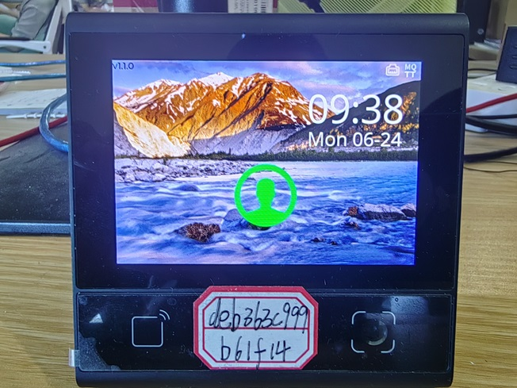
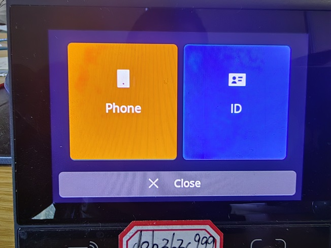
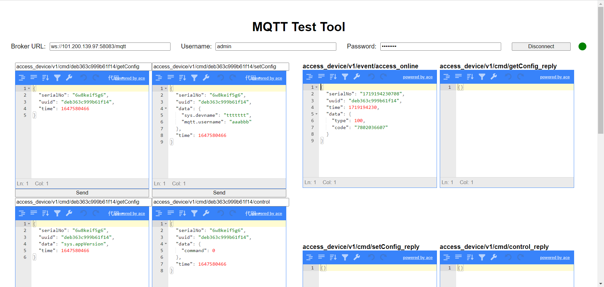
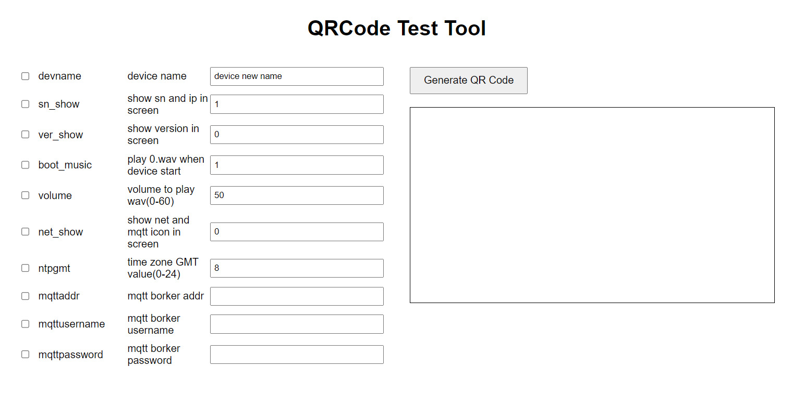

# **DW200_V20 Access Control System MQTT Communication Demo**

> **This demo is adapted from a real-world access control system application scenario, showcasing the practical implementation and technical approach of DW200_V20 devices in actual projects.**

## **DEMO Overview**

The device model is DW200_V20, a multifunctional all-in-one machine with a touchscreen.
In this DEMO, the DW200_V20 communicates northward with the application via the MQTT protocol and southward controls the door lock through GPIO.

This DEMO implements access control in three ways:

1. **QR Code Scanning**: The device scans the QR code and sends its content via MQTT to the application. The MQTT server determines whether to allow access based on the content.
2. **Mobile Number and Password**: Sent via MQTT to the MQTT server. The application determines whether to allow access based on the content.
3. **ID and Password**: Sent via MQTT to the MQTT server. The application determines whether to allow access based on the content.

If the application determines that access should be granted, it sends an MQTT command to remotely control the device's GPIO to unlock the door. Simultaneously, it plays a sound, displays corresponding images on the screen, etc., to notify the user.

## **Core Features**

### **Scanning Capabilities**

- Read QR Code or Barcode and automatically upload via MQTT after reading
- QR codes with special prefixes act as configuration codes, allowing the modification of device parameters such as MQTT Broker address, network information, screen display elements, etc.

### **Remote Control**

- Remote modification of basic device parameters via the MQTT protocol
- Control device behavior via MQTT protocol: remote audio playback, remote unlocking, and remote display of specified images
- Support upgrading JS code and resource files (audio, images, etc.) via QR code or MQTT protocol. Files are compressed into a zip and deployed at an accessible remote HTTP address

### **Touchscreen Interaction**

- Support touchscreen input for phone number, ID number, and password, sent to the application via MQTT protocol after confirmation
- Any operation on the screen triggers a short beep; configuration errors or operation errors trigger a long beep or double short beeps to notify the user

### **System Monitoring**

- Support watchdog functionality; the application will automatically restart if there is no response within the specified seconds
- Display Ethernet and MQTT icons on the screen to indicate network connection status and MQTT Broker connection status
- Display the current time on the screen; the device corrects time on every reboot and automatically calibrates every 24 hours

## **Directory Structure**

```
├── docs/           # Screenshots of the device screen
├── source/         # All source codes and resource files for the demo
└── test/           # MQTT testing tools and QR code generation tools
```

## **Code Architecture**

### **Multi-threaded Design**

A total of 4 workers (threads) are started:

- **Main Thread**: Main thread and UI refresh
- **MQTT Thread**: Receive MQTT data
- **Code Thread**: Capture QR code or barcode image and decode
- **Service Thread**: Subscribe to MQTT and code messages and perform corresponding processing; time-consuming operations are handled asynchronously via setTimeout

### **Main Directory/File Description**

```
source/
├── resource/
│   ├── wav/           # Multiple audio files
│   ├── image/         # Multiple images (background images, various icons, etc.)
│   └── font.ttf       # OpenSans-Regular font library
├── main.js            # Program entry point, initializes device threads and drivers, draws UI in loop
├── driver.js          # Initialization and simple encapsulation of various driver components for DW200_V20
├── codehandler.js     # QR code processing, configuration code triggers config modification, other QR codes pass through MQTT
├── config.json        # Device configuration initialization JSON file
├── constants.js       # Some constant settings
├── mqtthandler.js     # MQTT data processing, receiving and handling MQTT commands
└── service.js         # Subscribe to MQTT and code messages, call mqtthandler and codehandler for processing
```

## **Screenshots**

| Main UI                                | Menu UI                                |
| -------------------------------------- | -------------------------------------- |
|  |  |

| Phone Input UI                           | MQTT Test Tool                                       |
| ---------------------------------------- | ---------------------------------------------------- |
|  |  |

| QR Code Test Tool                                        |
| -------------------------------------------------------- |
|  |

## Device Compatibility

This demo currently runs on DW200_V20 devices. To run on other devices, simply update the corresponding modules as needed.

## Auto Reboot

Due to the use of a watchdog, if you start the application through VSCode and then stop it, the application will trigger a restart in about 20 seconds
