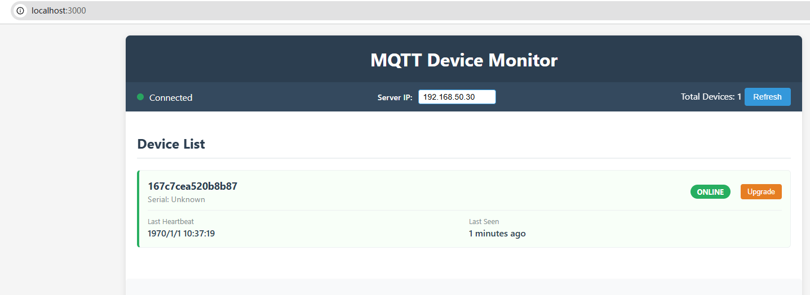
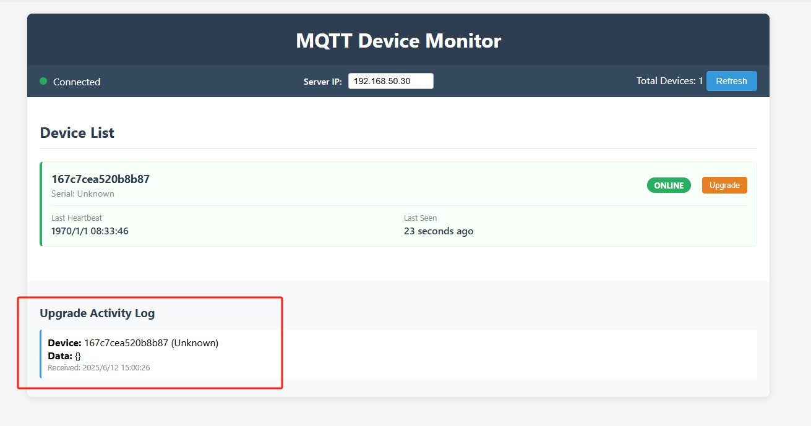
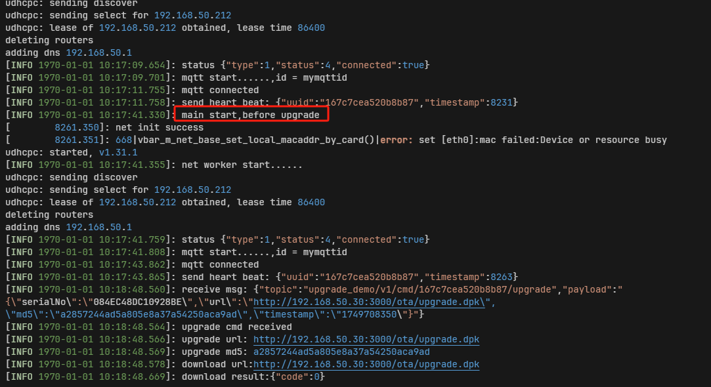
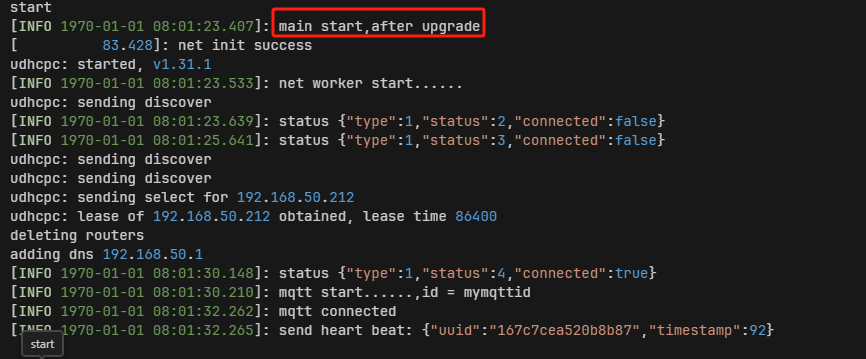

<p align="right">
    <a href="./README.md">English</a>| <b>中文</b>
</p>

# DejaOS 设备升级演示项目

这是一个基于 MQTT 协议的设备远程升级演示项目，包含设备端（client）和服务端（server）两个部分。项目演示了如何通过 MQTT 消息实现设备的远程监控和 OTA 升级功能。

## 项目概览

本项目包含两个主要组件：

- **Client（设备端）**: 基于 DejaOS 平台的设备客户端，负责连接 MQTT Broker、发送心跳消息、接收升级指令并执行 OTA 升级
- **Server（服务端）**: 基于 Node.js 的 Web 服务器，提供设备监控界面、MQTT 消息处理和升级包下载服务

> MQTT Broker 可以使用任意成熟的第三方 MQTT 软件和平台，推荐使用 EMQX
> 设备端程序目前选择的是 DW200 设备，如果想在其它设备运行，需要打开 app.dxproj 重新选择设备类型并选择配套的组件版本

## 功能流程

主要用于演示如何通过 MQTT 批量给多设备升级，主要原理是：

1. 设备端通过 Broker 通知服务端，设备已上线，并把设备的唯一标识 uuid 推送给服务端
2. 设备端订阅主题 'upgrade_demo/v1/cmd/' + uuid + '/upgrade' ，只对设备自身的 uuid 的 topic 订阅。
3. 服务端准备好升级包，可以通过 http url 下载这个升级包
4. 服务端选择一个或多个在线设备，把下载 url 和升级包的 md5 推送到指定设备，topic 是 'upgrade_demo/v1/cmd/' + uuid + '/upgrade'
5. 设备端收到后，通过 dxOta 下载 url 并校验 md5，重启后，升级包会覆盖当前应用

### 设备端功能

- ✅ 网络连接成功后启动 MQTT 工作线程
- ✅ MQTT 连接管理和断线重连
- ✅ 定时发送心跳消息（5 分钟间隔）
- ✅ 接收和处理升级指令
- ✅ HTTP 下载升级包并进行 MD5 校验
- ✅ 自动执行 OTA 升级和重启

### 服务端功能

- ✅ 实时 Web 设备监控界面
- ✅ MQTT 消息订阅和处理
- ✅ 设备在线/离线状态管理
- ✅ 升级包 HTTP 下载服务
- ✅ 可配置服务器 IP 地址
- ✅ 一键发送升级指令到指定设备

### 服务器启动

```bash
# 进入服务端目录
cd server

# 安装依赖
npm install

# 启动服务器
node ./index.js
```

服务器启动后，访问 `http://localhost:3000` 查看监控界面。



设备升级后：



### 设备端启动

升级包和原有设备应用的差别就是 main.js 打印的内容差异：

1. **升级前**：
   

2. **升级后**：
   

## MQTT 配置

### 连接参数

```javascript
// 默认MQTT配置（可根据实际情况修改）
mqttAddr: "tcp://101.200.139.97:51883";
clientId: "设备序列号";
username: "upgrade_demo";
password: "upgrade_demo_pwd";
```

### 主题说明

| 主题                                 | 方向 | 说明                     |
| ------------------------------------ | ---- | ------------------------ |
| `upgrade_demo/v1/event/heart`        | 上行 | 设备心跳消息             |
| `upgrade_demo/v1/event/offline`      | 上行 | 设备离线消息（遗嘱消息） |
| `upgrade_demo/v1/cmd/{uuid}/upgrade` | 下行 | 设备升级指令             |
| `upgrade_demo/v1/cmd/upgrade_reply`  | 上行 | 设备升级回复             |

### 消息格式

所有 MQTT 消息均采用 JSON 格式：

```json
{
  "serialNo": "设备序列号/随机字符串",
  "uuid": "设备唯一标识",
  "data": {},
  "timestamp": "10位时间戳"
}
```

#### 升级指令消息示例

```json
{
  "serialNo": "ABC123DEF456",
  "url": "http://192.168.1.100:3000/ota/upgrade.dpk",
  "md5": "d41d8cd98f00b204e9800998ecf8427e",
  "timestamp": "1704067200"
}
```

## 项目结构

```
dw200_mqtt_upgrade/
├── client/                    # 设备端代码
│   ├── src/
│   │   ├── main.js           # 主程序入口
│   │   └── mqttworker.js     # MQTT 工作线程
│   └── app.dxproj            # DX 项目配置文件
├── server/                    # 服务端代码
│   ├── index.js              # Node.js 服务器主文件
│   ├── index.html            # Web 监控界面
│   ├── package.json          # Node.js 项目配置
│   └── upgrade.dpk           # 升级包文件
└── README_CN.md              # 项目文档（中文）
└── README.md                 # 项目文档
```

