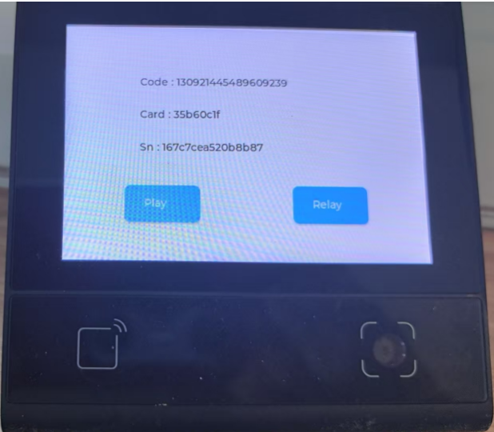

# DW200_V20 Project Template

An application development template project based on DW200_V20 device, providing complete scaffolding code that implements basic functions such as QR code scanning, card swiping, GPIO control, and audio playback.



## Project Overview

This project is a standard template for DW200_V20 device application development, adopting modular architecture design and providing encapsulation and demonstration implementation of commonly used hardware functions. Developers can quickly build custom applications based on this template.

## Main Features

- 🔍 **QR Code Scanning** - Supports camera scanning recognition
- 💳 **NFC Card Swiping** - Supports M1 card reading
- 🔌 **GPIO Control** - Hardware control such as relays
- 🔊 **Audio Playback** - WAV audio file playback
- 🌐 **Network Connection** - Ethernet connection management
- 📡 **UART485 Communication** - Serial communication functionality
- 📱 **Touch Screen Interface** - 480x320 resolution UI

## Project Architecture

```
src/
├── main.js              # Main entry file
├── controller.js        # Controller (independent thread)
├── services.js          # Service dispatch center
├── screen.js           # Screen management
├── driver.js           # Hardware abstraction layer
├── service/            # Business service modules
│   ├── codeService.js   # Scanning service
│   ├── nfcService.js    # NFC service
│   ├── netService.js    # Network service
│   └── uart485Service.js # UART communication service
└── view/               # View layer
    └── mainView.js      # Main interface view
```

### Architecture Features

- **Multi-threaded Architecture**: Main thread + Controller thread + Worker thread pool
- **Event-driven**: Uses event bus for inter-module communication
- **Layered Design**: Driver layer → Service layer → View layer
- **Modular**: Functional modules are independent, easy to extend and maintain

## Core Module Description

### 1. Main Entry (main.js)

- Initialize screen interface
- Start worker threads
- Create controller thread
- Configure event topic listening

### 2. Controller (controller.js)

- Runs in independent thread
- Initialize various hardware drivers
- Periodic loop processing of hardware events

### 3. Service Dispatch (services.js)

- Receive worker thread pool messages
- Dispatch to corresponding services based on message type
- Supported message types:
  - Scanning messages (`dxCode.RECEIVE_MSG`)
  - NFC messages (`dxNfc.RECEIVE_MSG`)
  - UART messages (`dxUart.VG.RECEIVE_MSG`)
  - Network status changes (`dxNet.STATUS_CHANGE`)

### 4. Hardware Driver (driver.js)

Provides unified hardware interface encapsulation:

#### GPIO Driver

```javascript
driver.gpio.init(); // Initialize
driver.gpio.open(); // Open relay
driver.gpio.close(); // Close relay
```

#### Audio Driver

```javascript
driver.alsa.init(); // Initialize
driver.alsa.play(audioFile); // Play audio
driver.alsa.volume(level); // Set volume
```

#### NFC Driver

```javascript
driver.nfc.init(); // Initialize
driver.nfc.loop(); // Loop detection
```

#### Scanning Driver

```javascript
driver.code.init(); // Initialize camera and decoder
driver.code.loop(); // Loop scanning
```

#### UART485 Driver

```javascript
driver.uart485.init(); // Initialize serial port
driver.uart485.send(data); // Send data
```

#### Network Driver

```javascript
driver.net.init(); // Initialize network
driver.net.loop(); // Network status monitoring
```

### 5. User Interface (mainView.js)

- 480x320 resolution interface
- Display scanning results and card information
- Provide audio playback and relay control buttons
- Display device serial number
  
## Device Compatibility

This demo currently runs on DW200_V20 devices. To run on other devices, simply update the corresponding modules as needed.

## Auto Reboot

Due to the use of a watchdog, if you start the application through VSCode and then stop it, the application will trigger a restart in about 20 seconds