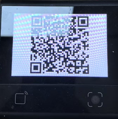

# QR Code Generator Demo

A simple DejaOS demo that generates and displays a QR code on the device screen.

## Screenshot



## Description

This is a basic demo that shows how to generate a QR code image using DejaOS and display it on the screen. The demo uses the dxUi module to create and render the QR code.


## QR Code Content

The demo generates a QR code with multilingual text:

```
"I am a QR code Ich bin ein QR-Code 我是二维码 私はQRコードです"
```

## Device Compatibility

This demo currently runs on DW200_V10 devices. To run on other devices, simply update the corresponding modules as needed.
