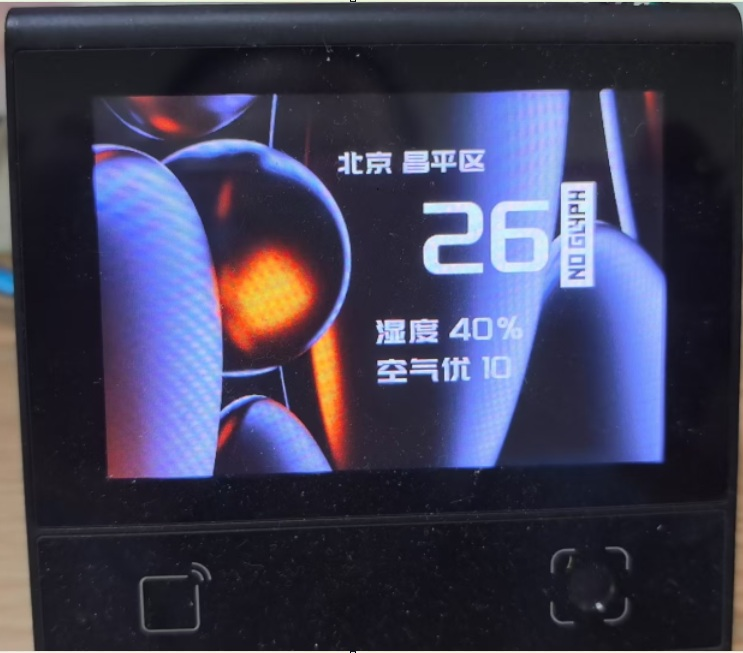
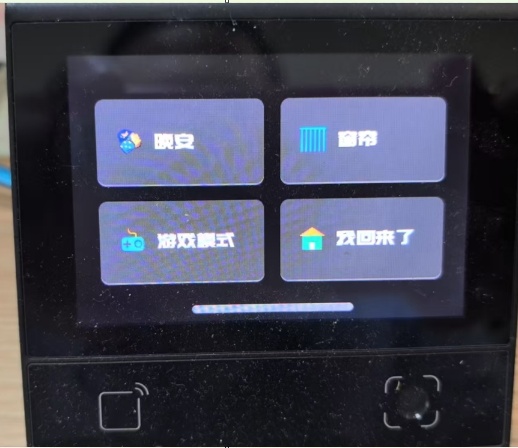
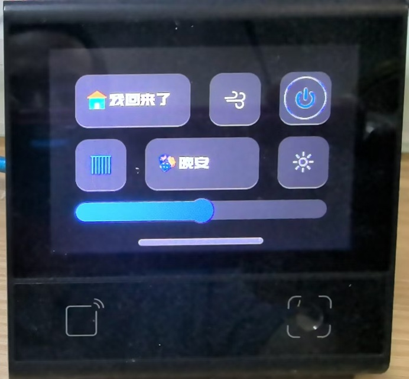
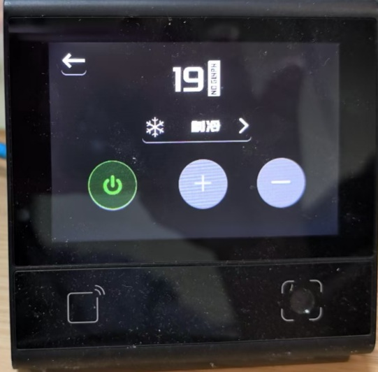

# Smart Home Control UI Demo

## Overview

This is a **UI demonstration project** built with the dxUi module for the DW200_V10 device. It showcases a modern smart home control interface design with **no actual business logic** - purely focused on UI layout, interactions, and visual presentation.

## Demo Features

### 📱 Multi-Page Interface Design

- **Page1**: Weather information display mockup (temperature, humidity, air quality)
- **Page2**: Digital clock interface with date and weekday
- **Page3**: Smart scene control panel with 4 action buttons
- **Page4**: Device control dashboard with mixed layout elements
- **Page5**: Air conditioner control interface (temperature adjustment demo)
- **Page6**: AC mode selection interface (fan/heat/cool modes)

### 🏠 Simulated Smart Scenes

- **Sleep Mode**: Bedtime scene button with visual feedback
- **Curtain Control**: Toggle-style curtain open/close interface
- **Gaming Mode**: Gaming environment scene activation UI
- **Welcome Home**: Home arrival scene with warm color themes

### 🔊 Audio Feedback System

- Voice prompts for different scene activations (Chinese language)
- UI interaction confirmation sounds
- Audio files for enhanced user experience

## Screenshots

### Main Interface Pages

#### Weather & Clock Display

#### Scene Control Panel

#### Device Control Dashboard

#### Air Conditioner Control

## Core Modules

### viewUtils.js

UI utility library providing:

- Font management with predefined font sizes
- Reusable UI components (buttons, switches, input fields)
- Layout utilities (panels, menus, navigation)
- Visual effects (notifications, shadows, animations)

### doplay.js

Audio demo module:

- WAV format audio playback
- Scene-specific voice prompts
- Volume control functionality

### Page Modules (page1-6.js)

Each page follows a consistent modular design:

- `init()`: Initialize page UI elements
- `load()`: Display and activate the page
- Event handling and page navigation logic

## UI Demo Navigation Flow

- **Auto Navigation**: Page1 ↔ Page2 every 5 seconds
- **Touch Navigation**:
  - Left click: Navigate to Page3 (Scene Control)
  - Right click: Navigate to Page4 (Device Control)
- **Device Detail Flow**: Page4 → Page5 (AC Control) → Page6 (AC Modes)
- **Back Navigation**: Return to previous pages via navigation buttons

## Device Compatibility

This demo currently runs on DW200_V10 devices. To run on other devices, simply update the corresponding modules as needed.
