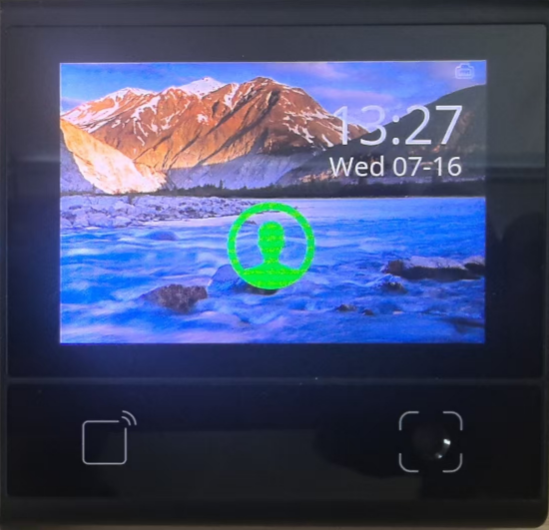
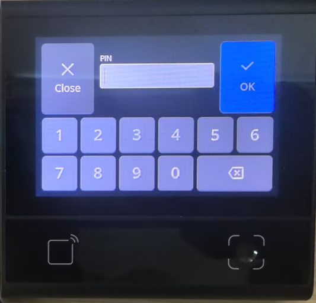

# **DW200_V10 Access Control System HTTP Communication Demo**

> **This demo is adapted from a real-world access control system application scenario, showcasing the practical implementation and technical approach of DW200_V10 devices in actual projects.**

## **DEMO Overview**

The device model is DW200_V10, a multifunctional all-in-one machine with a touchscreen.
In this DEMO, the DW200_V10 communicates northward with the application via the HTTP protocol and southward controls the door lock through GPIO.

This DEMO implements access control in two ways:

1. **QR Code Scanning**: The device scans the QR code and sends its content via HTTP to the application. The HTTP server determines whether to allow access based on the content.
2. **PIN Code Input**: Users can input PIN codes through the touchscreen interface, which are sent via HTTP to the server. The application determines whether to allow access based on the PIN.

If the application determines that access should be granted, it sends an HTTP response indicating success. The device then plays a success sound and displays corresponding images on the screen to notify the user.

## **Core Features**

### **Scanning Capabilities**

- Read QR Code or Barcode and automatically upload via HTTP after reading

### **Touchscreen Interaction**

- Support touchscreen input for PIN codes, sent to the application via HTTP protocol after confirmation
- Any operation on the screen triggers a short beep; configuration errors or operation errors trigger a long beep or double short beeps to notify the user

### **System Monitoring**

- Display Ethernet icon on the screen to indicate network connection status
- Display the current time on the screen; the device corrects time on every reboot and automatically calibrates every 24 hours

## **Directory Structure**

```
├── src/            # All source codes for the demo
│   ├── view/       # UI view components
│   ├── main.js     # Program entry point
│   ├── driver.js   # Device driver components
│   ├── service.js  # Service thread for background processing
│   ├── httphandler.js # HTTP communication handler
│   └── codehandler.js # QR code processing
├── resource/       # Resource files
│   ├── image/      # UI images and icons
│   └── font.ttf    # Font library
└── dxmodules/      # DX framework modules
```

## **Code Architecture**

### **Multi-threaded Design**

A total of 2 workers (threads) are started:

- **Main Thread**: Main thread and UI refresh
- **Service Thread**: Handle QR code capture and HTTP communication; time-consuming operations are handled asynchronously via setTimeout

### **Main Directory/File Description**

```
src/
├── main.js            # Program entry point, initializes device threads and drivers, draws UI in loop
├── driver.js          # Initialization and simple encapsulation of various driver components for DW200_V10
├── codehandler.js     # QR code processing, configuration code triggers config modification, other QR codes pass through HTTP
├── httphandler.js     # HTTP data processing, sending data to server and handling responses
├── service.js         # Subscribe to code messages, call httphandler and codehandler for processing
└── view/
    ├── mainview.js    # Main UI view implementation
    ├── entryview.js   # PIN entry UI view implementation
    └── viewhelper.js  # UI helper functions
```

## **HTTP Communication Protocol**

The device communicates with the HTTP server using the following format. The HTTP server demo is located in the ../server directory:

- **URL**: `http://192.168.50.31:3000/api/access`
- **Method**: GET
- **Parameters**:
  - `type`: The type of access request ("code" for QR code, "pin" for PIN input)
  - `data`: The actual data (QR code content or PIN code)

**Example Request**:

```
GET http://192.168.50.31:3000/api/access?type=code&data=123456789
GET http://192.168.50.31:3000/api/access?type=pin&data=1234
```

**Expected Response**:

```json
{
  "code": 0,
  "data": {
    "success": true
  }
}
```

## **Screenshots**

| Main UI                               | PIN Entry UI                                    |
| ------------------------------------- | ----------------------------------------------- |
|  |  |

## **Device Compatibility**

This demo currently runs on DW200_V10 devices. To run on other devices, simply update the corresponding modules as needed.

## **Configuration**

The HTTP server address is configured in `src/httphandler.js`:

```javascript
const url = "http://192.168.50.31:3000/api/access";
```

To change the server address, modify this URL to point to your HTTP server.

## **Features**

- **QR Code Scanning**: Automatic QR code detection and HTTP transmission
- **PIN Code Input**: Touchscreen PIN entry with numeric keypad
- **Audio Feedback**: Success/failure sounds for user feedback
- **Network Status**: Real-time network connection status display
- **Time Display**: Current date and time display with automatic synchronization
- **Error Handling**: Comprehensive error handling with user notifications
