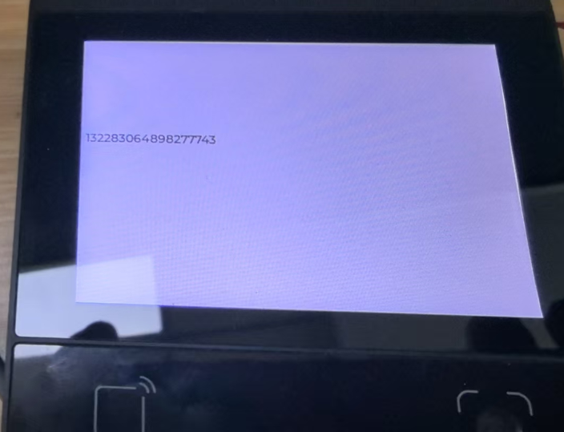

# **DW200_V20 Barcode Scanning System Demo**

> **This Demo showcases the complete barcode scanning capabilities of the DW200_V20 device, including real-time barcode detection, multiple barcode format support.**

## **DEMO Overview**

The device model is DW200_V20, a multifunctional all-in-one touchscreen device with integrated barcode scanning capabilities.
This DEMO focuses on barcode scanning functionality, providing a complete solution for barcode detection, processing, and display.

This DEMO implements the following features:

1. **Real-time Barcode Detection**: Continuous scanning and detection of various barcode formats
2. **Multiple Barcode Support**: Support for 1D and 2D barcode formats including QR codes, Code128, EAN, etc.
3. **Quality Assessment**: Real-time quality scoring for detected barcodes
4. **Data Integrity**: Preserves binary data integrity using ArrayBuffer for special characters
5. **Event-driven Architecture**: Asynchronous barcode detection with callback-based event handling
6. **Real-time Display**: Immediate display of scanned barcode content on the touchscreen

## **Directory Structure**

```
├── src/                    # All source code
│   ├── main.js            # Program entry point and UI setup
│   └── codeservice.js     # Barcode scanning service worker
├── dxmodules/             # DX framework modules
│   ├── dxBarcode.js       # Barcode scanning module
│   ├── dxUi.js            # UI framework module
│   ├── dxEventBus.js      # Event communication module
│   ├── dxLogger.js        # Logging module
│   ├── dxCommon.js        # Common utilities module
│   └── dxStd.js           # Standard library module
└── app.dxproj             # Project configuration file
```

## **Code Architecture**

### **Multi-threaded Design**

A total of 2 worker threads are started:

- **Main Thread**: Main thread and UI refresh, handles user interface and display
- **Barcode Service Thread**: Handles barcode scanning, detection, and processing operations

### **Main Directory/File Description**

```
src/
├── main.js               # Program entry point, initializes UI and event handlers
└── codeservice.js        # Barcode service worker, handles scanning and detection
```

### **Key Components**

- **dxBarcode Module**: Core barcode scanning functionality
- **Event Bus System**: Inter-thread communication for barcode events
- **UI Framework**: Touchscreen interface and display management
- **Logging System**: Comprehensive logging and debugging support

## **Barcode Function API**

### **dxBarcode Module Main Functions**

- **Initialization**: `dxBarcode.init()` - Initialize barcode scanning module
- **Callback Setup**: `dxBarcode.setCallbacks(callbacks)` - Set barcode detection callback
- **Event Processing**: `dxBarcode.loop()` - Process barcode events (call periodically)
- **Cleanup**: `dxBarcode.deinit()` - Clean up resources and deinitialize

### **Callback Function Signature**

```javascript
onBarcodeDetected: function(barcode, type, quality, timestamp) {
    // barcode: ArrayBuffer containing barcode data
    // type: Barcode type identifier
    // quality: Quality score (0-100)
    // timestamp: Detection timestamp
}
```

### **Event Bus Communication**

- `code`: Barcode detection event with data payload
- Real-time communication between scanning service and main UI thread
- Asynchronous event handling for optimal performance

## **Screenshots**



## **Device Compatibility**

This demo currently runs on DW200_V20 devices with integrated barcode scanning hardware. To run on other devices, ensure the device has compatible barcode scanning capabilities and update the corresponding modules as needed.

## **Data Processing**

```javascript
// Convert ArrayBuffer to string
let str = common.utf8HexToStr(common.arrayBufferToHexString(data));

// Display on UI
label.text(str);
```
