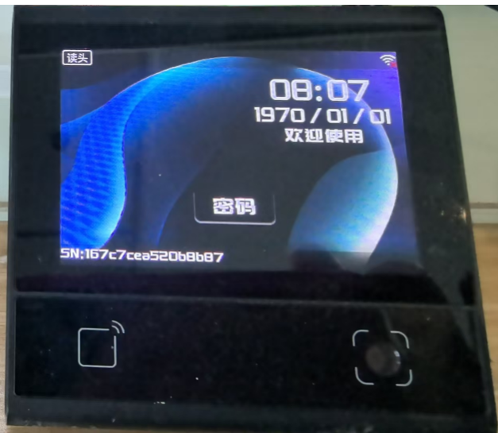

# DW200 Scanner Reader Application

## Overview

The DW200 Scanner Reader Application is a comprehensive, multi-functional reader system designed for industrial and commercial use. This official standard reader application provides extensive functionality for barcode scanning, NFC card reading, network communication, and device management with a modern touch screen interface.



_The main interface showing time display, WiFi connectivity status, device serial number, and password access button_

## Features

### Core Reading Capabilities

- **Barcode/QR Code Scanning**

  - Multiple barcode format support (configurable via bit masks)
  - Real-time scanning with configurable timeout and modes
  - Custom prefix/suffix support
  - Multiple output formats (raw, hex, decimal)
  - Interval and single-shot scanning modes

- **NFC Card Reading**
  - ISO14443-A/B and ISO15693 protocol support
  - Physical card number reading
  - Fixed sector and one-card-one-key encryption modes
  - M1 card read/write operations
  - Configurable card output formats and data processing

### Network & Communication

- **Multiple Network Interfaces**

  - WiFi (802.11) connectivity
  - Ethernet support
  - Dynamic and static IP configuration
  - Custom MAC address assignment

- **Communication Protocols**
  - TCP client/server support
  - HTTP communication
  - RS485/RS232 serial communication
  - TTL UART interface
  - Bluetooth Low Energy (BLE)

### Hardware Integration

- **GPIO Control**

  - Relay control with configurable timing
  - GPIO key input processing
  - Wiegand protocol support

- **Audio & Visual Feedback**

  - PWM-controlled buzzer with customizable tones
  - LED indicator control
  - Configurable volume levels
  - Boot sound notifications

- **Display Management**
  - Touch screen interface with multiple orientations
  - Configurable brightness and backlight
  - Custom background images
  - Multi-language support (Chinese/English)

### Security Features

- **Safe Module Integration**

  - Hardware security module support
  - Key management and encryption
  - Secure door control mechanisms

- **Access Control**
  - Password-based configuration access
  - Secure configuration code parsing
  - Device authentication

### System Management

- **Configuration System**

  - Comprehensive JSON-based configuration
  - Remote configuration via QR codes
  - Parameter validation and error handling
  - Configuration backup and restore

- **Monitoring & Diagnostics**

  - Multi-threaded watchdog system
  - System health monitoring
  - Network status tracking
  - Device information display

- **Update & Maintenance**
  - Over-the-air (OTA) updates
  - HTTP-based firmware updates
  - Resource file downloading
  - Automatic restart scheduling

## Architecture

### Modular Design

```
src/
├── main.js              # Application entry point
├── config.json          # Configuration file
├── driver.js            # Hardware abstraction layer
├── screen.js            # Display management
├── services.js          # Service orchestration
├── controller.js        # System controller
├── view/               # UI components
│   ├── mainView.js     # Main interface
│   ├── passwordView.js # Password input
│   └── popWin.js       # Pop-up windows
├── service/            # Business logic
│   ├── codeService.js  # Barcode processing
│   ├── nfcService.js   # NFC processing
│   ├── netService.js   # Network management
│   └── [other services]
└── common/             # Shared utilities
    ├── utils/
    └── consts/
```

### Key Components

#### Driver Layer (`driver.js`)

- Hardware abstraction for all device components
- GPIO, PWM, NFC, camera, network interfaces
- Watchdog and system monitoring
- Audio and visual feedback control

#### Service Layer (`service/`)

- **codeService**: Barcode/QR code processing and formatting
- **nfcService**: NFC card reading and data processing
- **netService**: Network connectivity management
- **configService**: Configuration management
- **safeService**: Security module integration

#### View Layer (`view/`)

- Touch screen interface components
- Multi-orientation display support
- Real-time status indicators
- User interaction handling

### File Structure

```
/app/code/
├── src/                 # Application source
├── dxmodules/          # Framework modules
├── resource/           # Images and assets
└── data/               # Runtime data
```

## Auto Reboot

Due to the use of a watchdog, if you start the application through VSCode and then stop it, the application will trigger a restart in about 20 seconds
