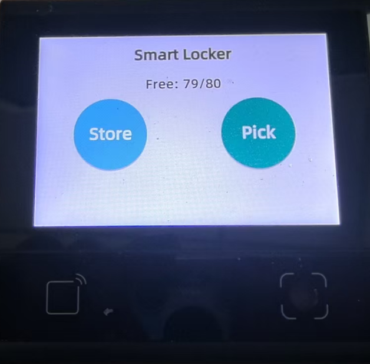
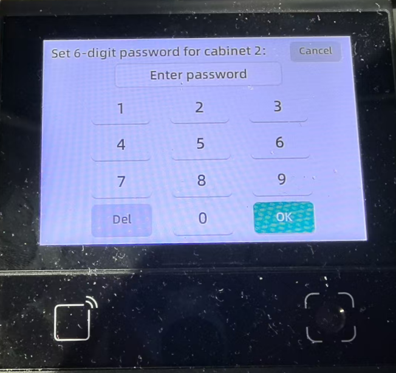
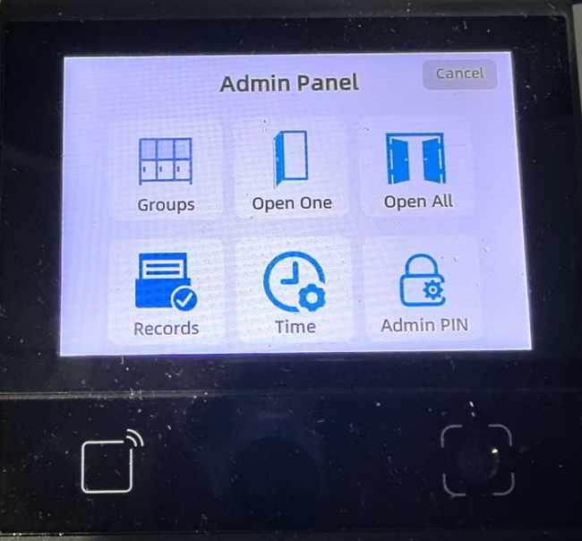

# Smart Locker System

A complete smart locker management system built for embedded devices using dejaOS platform. This application provides a user-friendly interface for storing and retrieving items from lockers, along with comprehensive administrative controls.



## 🎯 Project Overview

This Smart Locker application is a fully functional embedded system designed for the **DW200_V20** device. It features:

- **User Interface**: Intuitive touchscreen interface for storing and picking up items
- **Administrative Panel**: Complete management system for locker configuration, records, and settings
- **Hardware Integration**: Direct communication with lock control boards via RS-485
- **Data Persistence**: SQLite database for storing locker status, records, and configurations
- **Multi-worker Architecture**: Separated UI, business logic, and hardware communication workers

## 🤖 AI-Generated Application

**This entire application was generated through AI-assisted development.**

This project was created through **100+ conversations** with AI assistants, demonstrating the power of AI in full-stack embedded application development. The AI primarily referenced the development guide in `.prompt/main.md`, which contains comprehensive documentation about the dejaOS platform, including:

- Platform architecture and module overview
- UI development patterns and best practices
- UART/serial communication guidelines
- Database integration patterns
- Code templates and examples

The AI was able to generate:

- Complete UI pages with proper layout and event handling
- Business logic for locker operations (store, pickup, admin functions)
- Database schema and data access layer
- Hardware communication protocols (RS-485 lock board protocol)
- Multi-worker architecture with event-based communication
- Error handling and user feedback systems

All code comments and UI text have been translated to English for better maintainability.

## ✨ Features

### User Features

- **Store Items**: Select an available locker, set a 6-digit password, and store items
- **Pick Items**: Enter cabinet number and password to retrieve stored items
- **Real-time Status**: View available locker count on the home screen
- **Countdown Timers**: Automatic timeout for user operations

### Administrative Features

- **Locker Group Management**: Configure multiple locker groups with custom ranges
- **Manual Cabinet Control**: Open individual cabinets or all cabinets at once
- **Access Records**: View paginated history of all store/pickup operations
- **Time Settings**: Manual system time configuration
- **Password Management**: Set and change administrator password
- **Super Admin Access**: UUID-based super admin password for emergency access

## 📸 Screenshots

### Main Interface


The home screen displays available lockers and provides quick access to Store and Pick functions.

### Password Setup


Users set a 6-digit password when storing items. The interface includes a numeric keypad for easy input.

### Admin Panel


Administrators can access comprehensive management tools including group configuration, cabinet control, records, time settings, and password management.

## 🛠️ Technology Stack

### Platform

- **dejaOS**: JavaScript runtime for embedded devices
- **Target Device**: DW200_V20
- **Engine**: QuickJS + LVGL

### Core Modules

- `dxUi` - UI framework and components
- `dxEventBus` - Cross-worker messaging
- `dxSqliteDB` - Database operations
- `dxUart` - Serial communication (RS-485)
- `dxPwm` - Audio feedback (buzzer)
- `dxNtp` - Time synchronization
- `dxLogger` - Logging system
- `dxMap` - Shared memory across workers
- `dxStd` - Standard utilities
- `dxDriver` - Hardware drivers
- `dxOs` - OS-level functions
- `dxCommonUtils` - Common algorithms

## 📁 Project Structure

```
dw200_smart_locker/
├── app.dxproj                 # Project configuration
├── dxmodules/                  # dejaOS modules (auto-downloaded)
├── resource/                   # Application resources
│   ├── font/
│   │   └── font.ttf           # Font file for UI text
│   └── image/                  # UI icons and images
├── src/
│   ├── main.js                # Application entry point
│   ├── uiWorker.js            # UI worker entry
│   ├── lock/                   # Lock control module
│   │   ├── lockWorker.js      # Lock hardware worker
│   │   ├── LockBoardProtocol.js  # RS-485 protocol
│   │   ├── LockerDB.js        # Database layer
│   │   └── LockerService.js   # Business logic
│   ├── log/
│   │   └── LogProxy.js        # Logging proxy
│   └── pages/                  # UI pages
│       ├── UIManager.js       # Page stack manager
│       ├── HomePage.js        # Main interface
│       ├── PasswordView.js    # Reusable keypad component
│       ├── TipView.js         # Global notification component
│       ├── admin/             # Admin pages
│       │   ├── AdminHomePage.js
│       │   ├── AdminLoginPage.js
│       │   ├── AdminPasswordPage.js
│       │   ├── GroupConfigPage.js
│       │   ├── GroupEditPage.js
│       │   ├── OpenCabinetPage.js
│       │   ├── OpenAllCabinetsPage.js
│       │   ├── RecordsPage.js
│       │   └── TimeSettingsPage.js
│       └── user/              # User pages
│           ├── StoreConfirmPage.js
│           ├── StoreSetPasswordPage.js
│           ├── PickCabinetPage.js
│           └── PickPasswordPage.js
└── .prompt/
    ├── main.md                # Development guide (AI reference)
    └── UIManager.js           # UI manager template
```

## 🏗️ Architecture

### Multi-Worker Design

The application uses a multi-worker architecture for separation of concerns:

1. **Main Thread** (`main.js`)

   - Hardware initialization (PWM, GPIO)
   - Database initialization
   - Worker creation and coordination

2. **UI Worker** (`uiWorker.js`)

   - All UI rendering and user interaction
   - Page navigation and lifecycle management
   - UI event loop

3. **Lock Worker** (`lockWorker.js`)
   - RS-485 serial communication
   - Lock board protocol handling
   - Hardware command execution

### Communication Flow

- **Event Bus**: Workers communicate via `dxEventBus` for events and RPC calls
- **Shared Memory**: `dxMap` for cross-worker data caching
- **Database**: SQLite for persistent storage

## 🗄️ Database Schema

The application uses three main tables:

1. **config**: System configuration (admin password, etc.)
2. **cabinet_status**: Current status of each locker (occupied, password, timestamps)
3. **records**: Historical records of all store/pickup operations

## 🚀 Getting Started

### Prerequisites

- VSCode with dejaOS extension
- DW200_V20 device or compatible hardware
- Access to dejaOS component repository

### Installation

1. Open the project in VSCode
2. Ensure `app.dxproj` is configured correctly
3. Click "Install" in the dejaOS extension to download required modules
4. Deploy to target device

### Configuration

1. **Locker Groups**: Configure locker groups via Admin Panel → Groups
2. **Admin Password**: Set administrator password via Admin Panel → Admin PIN
3. **System Time**: Configure time via Admin Panel → Time Settings

## 📝 Development Notes

### Code Style

- All code comments are in English
- UI text is concise and in English
- Consistent naming conventions (camelCase for variables, PascalCase for classes)

### Key Design Patterns

- **Page Stack Management**: Single-screen multi-page navigation via `UIManager`
- **Event-Driven Architecture**: Cross-worker communication via event bus
- **Service Layer**: Business logic separated in `LockerService`
- **Protocol Abstraction**: Hardware communication abstracted in `LockBoardProtocol`

## 🔧 Hardware Requirements

- **Device**: DW200_V20
- **Display**: Touchscreen (resolution defined in `dxDriver.DISPLAY`)
- **Serial**: RS-485 interface for lock control board
- **Audio**: PWM buzzer for user feedback

## 📚 Reference Documentation

The AI development process was guided by `.prompt/main.md`, which contains:

- dejaOS platform overview
- Module documentation
- UI development patterns
- Code templates and examples
- Best practices for embedded development

## 🤝 Contributing

This project was generated through AI-assisted development. For modifications:

1. Review the development guide in `.prompt/main.md`
2. Follow the existing code patterns
3. Maintain English comments and UI text
4. Test on target hardware before deployment

## 📄 License

This project is provided as-is for demonstration purposes.

---

**Note**: This application demonstrates the feasibility of AI-assisted development for embedded systems. The entire codebase, architecture, and implementation were generated through iterative AI conversations, showcasing the potential of AI in complex software development scenarios.
