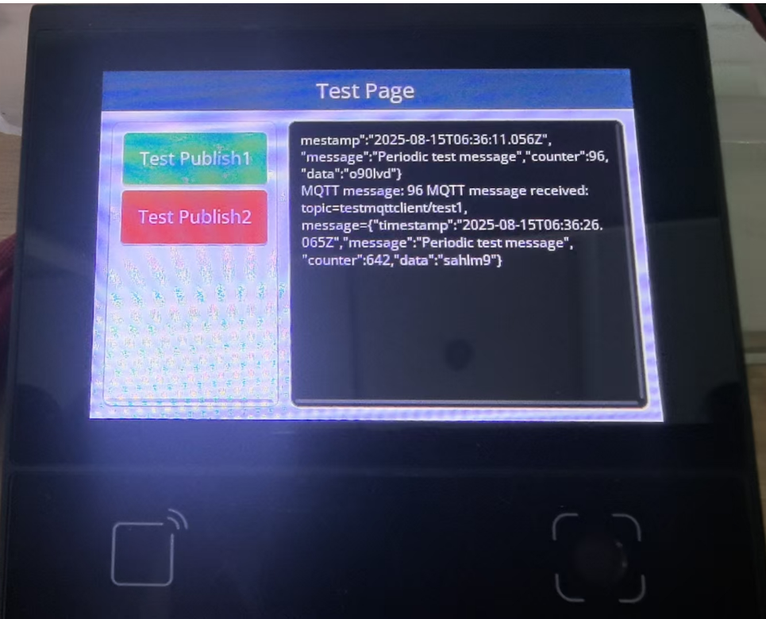

# **DW200_V20 MQTT Client Testing System Demo**

> **This demo showcases the MQTT client capabilities of the DW200_V20 device, providing a comprehensive testing environment for MQTT communication, message publishing, subscription, and real-time data exchange.**

## **DEMO Overview**

The device model is DW200_V20, a multifunctional all-in-one machine with a touchscreen.
In this DEMO, the DW200_V20 acts as an MQTT client, connecting to an MQTT broker for testing various MQTT communication scenarios.

This DEMO implements MQTT testing in the following ways:

1. **MQTT Client Connection**: Automatic connection to MQTT broker with WiFi network
2. **Message Publishing**: Test buttons for publishing messages to specific topics
3. **Topic Subscription**: Subscribe to multiple topics for receiving messages
4. **Real-time Communication**: Bidirectional communication with MQTT server
5. **Network Integration**: Seamless integration with WiFi network connectivity
6. **Auto-reconnection**: Automatic reconnection handling for network interruptions

## **Core Features**

### **MQTT Client Capabilities**

- Connect to MQTT broker with configurable server address and client ID
- Support for QoS levels (0, 1, 2) for message delivery guarantees
- Automatic reconnection handling for network interruptions
- Real-time message publishing and subscription
- Message delivery confirmation and status tracking

### **Network Integration**

- WiFi network connection with DHCP support
- Network status monitoring and real-time updates
- Seamless integration between network and MQTT layers
- Automatic network reconnection and recovery

### **User Interface**

- Clean and intuitive touchscreen interface
- Dynamic button creation based on configuration
- Real-time log display for MQTT operations
- Network status indication and monitoring
- Touch-friendly controls with visual feedback

## **Directory Structure**

```
├── client/                 # DW200_V20 device client code by dejaos
│   ├── src/               # Source code files
│   │   ├── main.js        # Program entry point and UI setup
│   │   ├── testPage.js    # Test page interface implementation
│   │   ├── testworker.js  # MQTT client worker thread
│   │   └── viewUtils.js   # UI utility functions
│   ├── dxmodules/         # DX framework modules
│   ├── resource/          # Resource files
│   └── app.dxproj         # Project configuration
├── server/                 # MQTT test server
│   ├── testserver.js      # MQTT broker implementation by nodejs
│   ├── package.json       # Node.js dependencies
│   └── node_modules/      # Installed packages
└── README.md              # This documentation file
```

## **Code Architecture**

### **Multi-threaded Design**

A total of 2 worker threads are started:

- **Main Thread**: Main thread and UI refresh, handles user interface and display
- **Test Worker Thread**: Handles MQTT client operations, network connectivity, and message processing

### **Key Components**

- **dxMqttClient Module**: Core MQTT client functionality
- **dxNetwork Module**: Network connectivity and management
- **Event Bus System**: Inter-thread communication for MQTT events
- **UI Framework**: Touchscreen interface and display management

## **MQTT Function API**

### **dxMqttClient Module Main Functions**

- **Initialization**: `mqttclient.init(url, clientId)` - Initialize MQTT client
- **Callback Setup**: `mqttclient.setCallbacks(callbacks)` - Set MQTT event callbacks
- **Connection**: `mqttclient.connect()` - Connect to MQTT broker
- **Subscription**: `mqttclient.subscribe(topic, options)` - Subscribe to topics
- **Publishing**: `mqttclient.publish(topic, payload, options)` - Publish messages

### **Event Bus Communication**

- `mqtt_publish`: MQTT publish request event
- `mqtt_msg`: MQTT message received event
- `network_status_change`: Network status change event

## **Configuration Instructions**

### **Client Configuration**

MQTT client parameters are configured in `client/src/testworker.js`:

```javascript
const url = "tcp://192.168.50.36:1883"; // MQTT broker URL
const clientId = "my-device-12345"; // Client identifier

// WiFi configuration
net.connectWifiWithDHCP("vguangYPT", "vguangypt_o0");
```

### **Test Button Configuration**

Test scenarios are configured in `client/src/main.js`:

```javascript
const configs = [
  {
    text: "Test Publish1",
    color: 0x27ae60,
    action: () => {
      bus.fire("mqtt_publish", {
        topic: "testmqttclient/test3",
        payload: "Hello1, MQTT Server!",
      });
    },
  },
];
```

## **Screenshots**



## **Device Compatibility**

This demo currently runs on DW200_V20 devices with WiFi connectivity. To run on other devices, ensure the device has compatible network capabilities and update the corresponding modules as needed.

## **Installation and Setup**

### **Client Setup**

1. Deploy the client code to the DW200_V20 device
2. Configure WiFi credentials in `testworker.js`
3. Update MQTT broker URL if needed
4. Start the application

### **Server Setup**

1. Navigate to the server directory: `cd server`
2. Install dependencies: `npm install`
3. Start the server: `npm start`
4. Server will listen on port 1883

