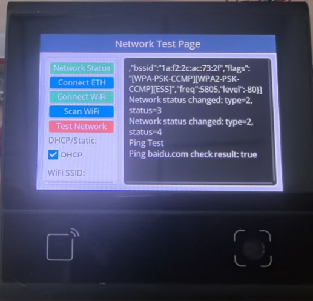

# **DW200_V20 Network Testing and Diagnostic System Demo**

> **This Demo showcases the complete network connection, configuration, and diagnostic capabilities of the DW200_V20 device, including Ethernet and WiFi connection testing, network status monitoring, ping testing, and other practical features.**

## **DEMO Overview**

The device model is DW200_V20, a multifunctional all-in-one touchscreen device.
This DEMO focuses on network function testing and diagnostics, providing a complete network connection, configuration, and testing solution.

This DEMO implements the following features:

1. **Network Status Monitoring**: Real-time display of Ethernet and WiFi connection status, monitoring network parameter changes
2. **Ethernet Connection**: Support for both DHCP automatic IP acquisition and static IP configuration for Ethernet connection
3. **WiFi Connection**: Support for WiFi scanning, connection configuration, with both DHCP and static IP modes
4. **Network Diagnostics**: Provides ping testing functionality to verify network connectivity
5. **Configuration Management**: Support for dynamic configuration of WiFi SSID, password, IP address, and other network parameters
6. **Property Editing**: IP, SSID, password, static mask, and DNS all support clicking to open full keyboard for modification

## **Core Features**

### **Network Connection Management**

- Support for both Ethernet and WiFi dual connection methods
- Support for DHCP automatic IP acquisition and static IP manual configuration
- Real-time network status monitoring and status change notifications
- Dynamic network parameter configuration and saving

### **WiFi Features**

- WiFi network scanning, displaying available network lists
- WiFi connection configuration, supporting WPA/WPA2 encryption
- WiFi signal strength and quality monitoring
- Support for multiple WiFi network configuration switching

### **Network Diagnostic Tools**

- Ping testing functionality to verify network connectivity
- Real-time network status logging
- Automatic retry mechanism for connection failures
- Real-time network parameter display

### **User Interface**

- Intuitive touchscreen operation interface
- Left-right split panel design, with function buttons on the left and log display on the right
- Real-time network status icon display
- Support for full keyboard input of network configuration parameters

## **Directory Structure**

```
├── src/                    # All source code
│   ├── main.js            # Program entry point
│   ├── netTestPage.js     # Network test page main interface
│   ├── networker.js       # Network processing worker thread
│   ├── fullkeyboard.js    # Full keyboard input component
│   └── viewUtils.js       # UI utility functions
├── resource/              # Resource files
│   └── font/             # Font files
└── dxmodules/            # DX framework modules
```

## **Code Architecture**

### **Multi-threaded Design**

A total of 2 worker threads are started:

- **Main Thread**: Main thread and UI refresh
- **Network Worker Thread**: Handles network connection, scanning, and testing time-consuming operations, communicating with the main thread via event bus

### **Main Directory/File Description**

```
src/
├── main.js               # Program entry point, initializes device threads and drivers, loops to draw UI
├── netTestPage.js        # Network test page main interface implementation, contains all UI components and event handling
├── networker.js          # Network processing worker thread, handles network connection, scanning, ping testing, etc.
├── fullkeyboard.js       # Full keyboard input component, used for network parameter configuration
└── viewUtils.js          # UI utility functions, provides common UI component creation methods
```

## **Network Function API**

### **dxNetwork Module Main Functions**

- **Network Initialization**: `net.init()` - Initialize network module
- **Status Callback**: `net.setCallbacks()` - Set network status change callback
- **Ethernet Connection**:
  - `net.connectEthWithDHCP()` - DHCP method to connect Ethernet
  - `net.connectEth(config)` - Static IP method to connect Ethernet
- **WiFi Connection**:
  - `net.connectWifiWithDHCP(ssid, password)` - DHCP method to connect WiFi
  - `net.connectWifi(ssid, password, config)` - Static IP method to connect WiFi
- **WiFi Scanning**: `net.scanWifi(timeout, interval)` - Scan available WiFi networks
- **Network Parameters**: `net.getNetParam()` - Get current network parameters
- **Network Loop**: `net.loop()` - Network status loop processing

### **Event Bus Communication**

- `network_status_change`: Network status change event
- `network_scan_wifi`: WiFi scan request event
- `network_scan_wifi_result`: WiFi scan result event
- `ping_test`: Ping test request event
- `ping_test_result`: Ping test result event

## **Interface Function Description**

### **Left Function Panel**

1. **Network Status**: Get and display current network status and parameters
2. **Connect ETH**: Connect Ethernet (DHCP or static IP)
3. **Connect WiFi**: Connect WiFi network
4. **Scan WiFi**: Scan available WiFi networks
5. **Test Network**: Execute ping test to verify network connectivity
6. **DHCP/Static**: DHCP and static IP mode switching
7. **WiFi SSID**: WiFi network name configuration
8. **WiFi Password**: WiFi password configuration

### **Right Log Panel**

- Real-time display of network operation logs
- Display network status change information
- Display WiFi scan results
- Display ping test results
- Support for log scrolling and viewing

## **Network Configuration Parameters**

```javascript
let data = {
  ssid: "vguangYPT", // WiFi network name
  password: "vguangypt_o0", // WiFi password
  ip: "192.168.50.88", // Static IP address
  dns: "8.8.8.8", // DNS server
  gateway: "192.168.50.1", // Gateway address
  netmask: "255.255.255.0", // Subnet mask
  dhcp: true, // DHCP mode switch
};
```

## **Screenshots**



## **Device Compatibility**

This demo currently runs on DW200_V20 devices. To run on other devices, simply update the corresponding modules as needed.

## **Configuration Instructions**

Network configuration parameters are defined in the `data` object in `src/netTestPage.js`:

```javascript
let data = {
  ssid: "vguangYPT",
  password: "vguangypt_o0",
  ip: "192.168.50.88",
  dns: "8.8.8.8",
  gateway: "192.168.50.1",
  netmask: "255.255.255.0",
  dhcp: true,
};
```

To modify network configuration, please update these parameter values.

## **Feature Characteristics**

- **Network Status Monitoring**: Real-time monitoring of Ethernet and WiFi connection status
- **Multiple Connection Methods**: Support for both Ethernet and WiFi dual connections
- **Flexible Configuration**: Support for both DHCP and static IP configuration modes
- **WiFi Scanning**: Automatic scanning and display of available WiFi networks
- **Network Diagnostics**: Built-in ping testing functionality to verify network connectivity
- **Real-time Logging**: Complete network operation log recording
- **Touch Operation**: Intuitive touchscreen operation interface
- **Parameter Configuration**: Support for dynamic configuration of network parameters
- **Error Handling**: Comprehensive error handling and user notifications
