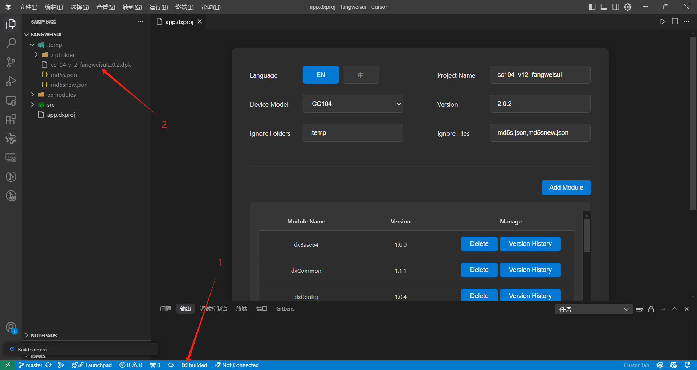
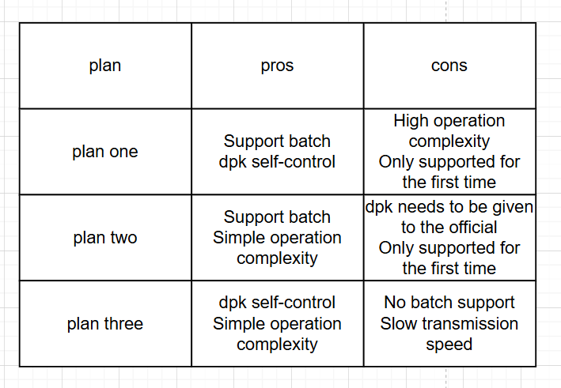
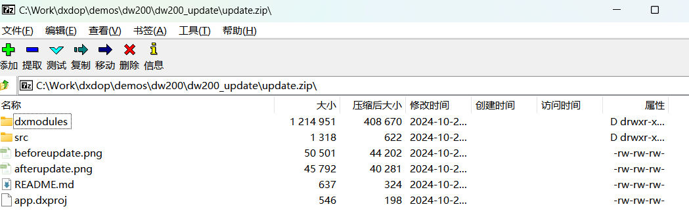

    <b>English</b>| <a href="./app_CN.md">中文</a>

# Application Packaging, Installation, and Upgrade
## Overview

After development is complete, applications on dejaOS need to be packaged and installed onto other devices. Taking the DW200 as an example (other devices are similar or identical), the typical process is as follows:

1. Purchase a small number of DW200 development devices (possibly just one), develop your own JavaScript code, debug and test until all requirements are met, and then package the application.
2. Purchase multiple DW200 production devices and install the packaged application onto these devices.

Packaging, installation, and upgrade differ between `DejaOS1.0` and `DejaOS2.0`. We’ll cover them separately. (DejaOS1.0 is an older version; all newly sold devices use DejaOS2.0.)

> How to check the DejaOS version?
> - Use the `dejaos_tools` tool to connect to the device and check the system version. If the connection is successful and version info is retrieved, it’s DejaOS2.0. If not, it’s DejaOS1.0.

## DejaOS2.0
### Application Packaging
Packaging on DejaOS2.0 can be done using the DejaOS plugin in VS Code. See screenshot below:

### Application Installation
Application installation is natively supported by the DejaOS system and requires no additional implementation. Both development and production devices support it.

- RS485 + dejaos_tools ([Click to download](../tools/tools.zip))

### Application Upgrade
Application upgrades are handled within the application itself. This allows custom logic tailored to your app.  
For example, our access control app supports upgrades via MQTT and QR codes.

`It is strongly recommended that developers implement upgrade logic in their own applications.`  
You can use the [dxOta](/src/dxOta/dxOta.js) component and follow the guide on [GitHub](https://github.com/duoxianwulian/DejaOS/tree/main/demos/dw200/dw200_update_new) to implement upgrade capabilities.

- DejaOS2.0 applications use `dxOta.updateHttp` or `dxOta.updateFile` methods. These allow upgrades via HTTP or file path. Place the upgrade file at the designated path and restart the device — DejaOS2.0 will handle decompression and installation.

**Clarification**

`Upgrade packages` and `installation packages` can be the same file with identical build logic.  
The terms `Application Installation` and `Application Upgrade` distinguish whether DejaOS system features or in-app logic is used. Installation typically applies when the app is missing or corrupted, while upgrade is an internal app function.

### From Development to Production
After development and debugging are complete, you can scale to multiple production devices using the following methods:

**Method 1**  
Directly purchase production devices of the same model. These devices come preloaded with official standard apps, which include upgrade functionality.  
However, the specific upgrade method depends on the model and type:

- **By app type**
  - Access control apps: Support MQTT-based upgrades

- **By device capability**
  - QR devices: Support QR-based upgrades (scan a code containing an upgrade HTTP path)

Some devices may support multiple upgrade methods. For example, a QR-capable access control device can use both QR and MQTT upgrades.  
If you’re unsure, please contact official support.

**Method 2**  
DejaOS developers can directly give the dpk file completed by development and debugging to the DejaOS official.  DejaOS officials will assign a specified version id to the dpk.  Developers can purchase equipment based on this version id.  Version id example: `vf205_v12_dejaxxx_2.0.0`.  DejaOS official will install dpk into the device when it is shipped.  The official shipment is to only observe whether the `dpk` start effect is normal, and the `dpk` will not be tested in detail by default.

**Method 3**  
Developers can buy devices freely and use RS485-to-USB cable + `dejaos_tools` to install the app. This method supports DejaOS2.0 and above.

**Method 4**  
A new version of `dejaos_tools` with batch install functionality is under development. Release date TBD.

> Refer to the image above for a comparison of these methods. Choose based on your scenario. If none meet your needs, contact us for customized support.

 
 

## DejaOS1.0
### Application Packaging
For DejaOS1.0, packaging must be done manually. Compress the `dxmodules`, `src`, and other custom directories into a `.zip` file, as shown:

### Application Installation
- Not supported.

### Application Upgrade
- DejaOS1.0 upgrades are done using `dxOta.update`, which decompresses a `.zip` package downloaded to `/ota/download.zip`.

- Alternatively, download the `.zip` upgrade package to `/app/data/upgrades/APP_1_0.zip` and restart the device — DejaOS1.0 will automatically decompress and apply the upgrade.

> Note: DejaOS1.0 users may continue using the original upgrade process. Each version supports upgrade from its previous version. However, it is highly recommended to upgrade to DejaOS2.0, as support for DejaOS1.0 is being phased out.
