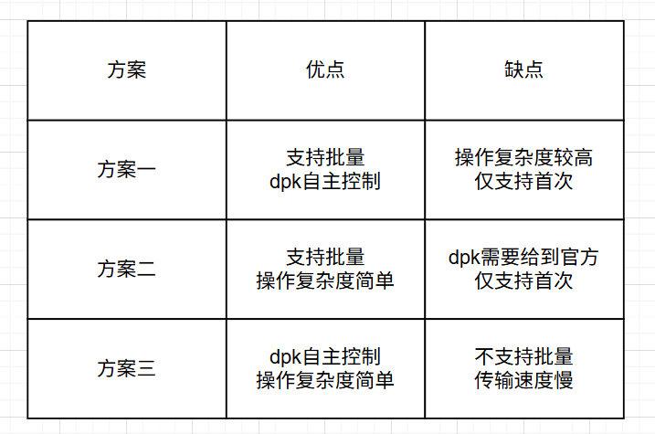

    <a href="./app.md">English</a>| <b>中文</b>

# 应用打包、安装和升级
## 概述

dejaOS 的应用在开发完成后需要打包并安装到其他设备上。以 DW200 为例（其他设备类似或相同），通常过程如下：

1. 购买少量的 DW200 开发设备，可能只有一台，开发自己的 JavaScript 代码，进行开发和调试，直到完成预期的需求，然后打包应用。
2. 购买多个 DW200 生产设备，将打包好的应用安装到这些设备上。

`DejaOS1.0` 和 `DejaOS2.0`的打包、安装和升级都有差异，我们分开来看（DejaOS1.0是很久远的版本，目前近期售卖的设备都是DejaOS2.0）。

> 如何查询DejaOS版本?
> - 使用`dejaos_tools`工具连接设备，查询设备版本，如果连接成功能查询到信息，则是DejaOS2.0。如果无法连接或者查询不到信息，则是DejaOS1.0。

## DejaOS2.0
### 应用打包
DejaOS2.0打包可以使用VScode中DejaOS插件完成，参考如下截图：

### 应用安装
应用安装是DejaOS系统支持的功能，不需要额外的应用实现，DejaOS开发设备和生产设备都支持。

- RS485 + dejaos_tools  ([点击下载](../tools/tools.zip))

### 应用升级
应用升级，是开发应用中自己具备的升级能力，自升级能力可以很好的贴合自己的应用。
比如我们门禁标品的应用中具备mqtt和扫码功能，门禁标品支持mqtt设扫码升级。
`强烈建议开发者或必须在自己应用中添加升级逻辑代码`，开发者自主开发的应用可以使用[dxOta](/src/dxOta/dxOta.js)组件，参照[GitHub](https://github.com/DejaOS/DejaOS/tree/main/demos/dw200/dw200_update_new)。完成应用升级。

- DejaOS2.0应用升级使用`dxOta.updateHttp`或`dxOta.updateFile`方法，通过http方式或指定文件路径方式，将文件放到指定的升级路径并重启，DejaOS2.0负责解压完成升级

**差异化解释**

`升级包` 和 `安装包` 可以是同一个，两者的构建逻辑相同。
`应用安装` 和 `应用升级` 用于区分是否使用DejaOS系统能力安装应用，应用安装使用的是DejaOS系统具备的安装功能，应对无应用或应用损坏的场景。应用升级是使用应用本身的升级能力。

### 开发转生产
完成开发设备的应用开发调试后，需要采购多台生产设备时并更新成自己的应用，可以使用以下几种方案：

**方案一**

直接购买同型号的生产设备，生产设备发货默认带有官方标品应用，标品应用具备应用升级能力，但不同型号的设备，不同类型的标品具备的升级能力和方式不同，标品应用升级能力遵循一下原则：
- **按标品类型划分**
  - 门禁标品：具有mqtt协议功能，支持mqtt升级

- **按设备能力划分**
  - 扫码设备：具有qr码扫描能力，支持qr码升级（扫码将升级包的http路径给到设备升级）

以上升级能力根据设备能力和标品类型不同会有叠加效果，比如扫码门禁标品，会同时具备扫码升级和MQTT升级，如果此步骤存在疑问，可联系官方人员。

**方案二**

DejaOS开发者可以直接将开发调试完成的dpk文件给到DejaOS官方，DejaOS官方会为dpk分配一个指定版本id，开发者可以根据这个版本id采购设备，版本id示例：`vf205_v12_dejaxxx_2.0.0`。DejaOS官方会将dpk出厂时安装到设备中，官方出货是仅观察`dpk`启动效果是否正常，默认不会对`dpk`做详细业务测试。

**方案三**

开发者可随意购买相同型号的设备，使用RS485转USB线 + dejaos_tools工具安装应用，dejaos_tools升级支持系统版本DejaOS2.0及以上

**方案四**

计划后续推出新版本工具`dejaos_tools`，加入支持批量安装功能，预研中，发布时间待定。

> 各方案优缺点可参考图片，这几种方案可以根据场景和需求选用，如果都不满足，请联系官方扩展

 
 

## DejaOS1.0
### 应用打包
DejaOS1.0打包需要手动完成，即将项目的 `dxmodules` 目录、`src` 以及其他自定义目录压缩成一个 zip 文件，参考如下截图：

### 应用安装
- 无

### 应用升级
- DejaOS1.0应用升级使用`dxOta.update`方法，将`zip`升级包，下载到`/ota/download.zip`，`dxOta.update`负责解压，最终完成升级

- DejaOS1.0也可以将`zip`升级包，下载到`/app/data/upgrades/APP_1_0.zip`，重启后DejaOS1.0自动解压，最终完成升级

> 注：DejaOS1.0用户可继续保持原有升级方式，每个OS版本都支持向上个版本升级，建议当前DejaOS1.0的用户联系官方升级至DejaOS2.0（不推荐长期使用DejaOS1.0，官方逐步减少DejaOS1.0的支持和维护）。

